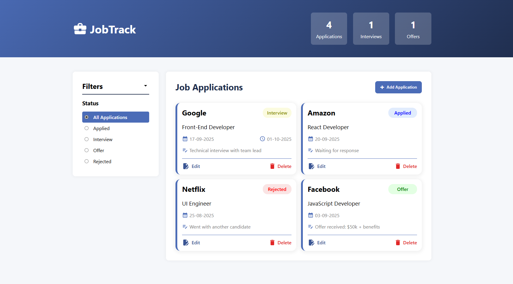

# JobTrack - Job Application Tracker


A modern, responsive web application to track and manage your job applications throughout your job search journey.



## ✨ Features

- **Dashboard Overview**: Visual statistics of your applications, interviews, and offers
- **Smart Filtering**: Filter applications by status (Applied, Interview, Offer, Rejected)
- **Responsive Design**: Works seamlessly on desktop, tablet, and mobile devices
- **Interactive UI**: Smooth animations and hover effects
- **Easy Management**: Add and delete applications with intuitive forms
- **Status Tracking**: Color-coded status indicators for quick visual reference

## 🚀 Live Demo

Check out the live application: [https://Srdjan-P.github.io/JobTrack](https://Srdjan-P.github.io/JobTrack)

## 🛠️ Technologies Used

- **Frontend**: React 18, Hooks (useState)
- **Build Tool**: Vite
- **Styling**: Sass, CSS Grid, Flexbox
- **Icons**: Material UI Icons
- **Date Handling**: date-fns library
- **Deployment**: GitHub Pages

## 📦 Installation

1. Clone the repository:

```bash
git clone https://github.com/Srdjan-P/JobTrack.git
```

2. Navigate to the project directory:

```bash
cd JobTrack
```

3. Install dependencies:

```bash
npm install
```

4. Start the development server:

```bash
npm run dev
```

5. Open http://localhost:5173 to view it in the browser.

🎯 Usage

View Applications: See all your job applications in a clean card layout

Check Statistics: Monitor your progress with the header statistics

Filter Applications: Use the filter panel to view applications by status

Add New Application: Click "+ Add Application" to create new entries

Manage Applications: Delete applications as needed

📱 Responsive Design

JobTrack is fully responsive and optimized for:

Desktop (1200px+)

Tablet (850px - 1199px)

Mobile (< 850px)

The filter panel collapses into an accordion on mobile devices for better space utilization.

🔧 Building for Production

    npm run build

This creates a dist folder with optimized production files.

🌐 Deployment

The application is deployed using GitHub Pages. To deploy:

npm run deploy

🤝 Contributing

Contributions, issues, and feature requests are welcome! Feel free to check issues page.

📄 License

This project is open source and available under the MIT License.

👨‍💻 Author

Srdjan-P

GitHub: @Srdjan-P

🙏 Acknowledgments

React team for the amazing framework

Vite for fast build tooling

Material UI for beautiful icons

Inspiration from job seekers everywhere
